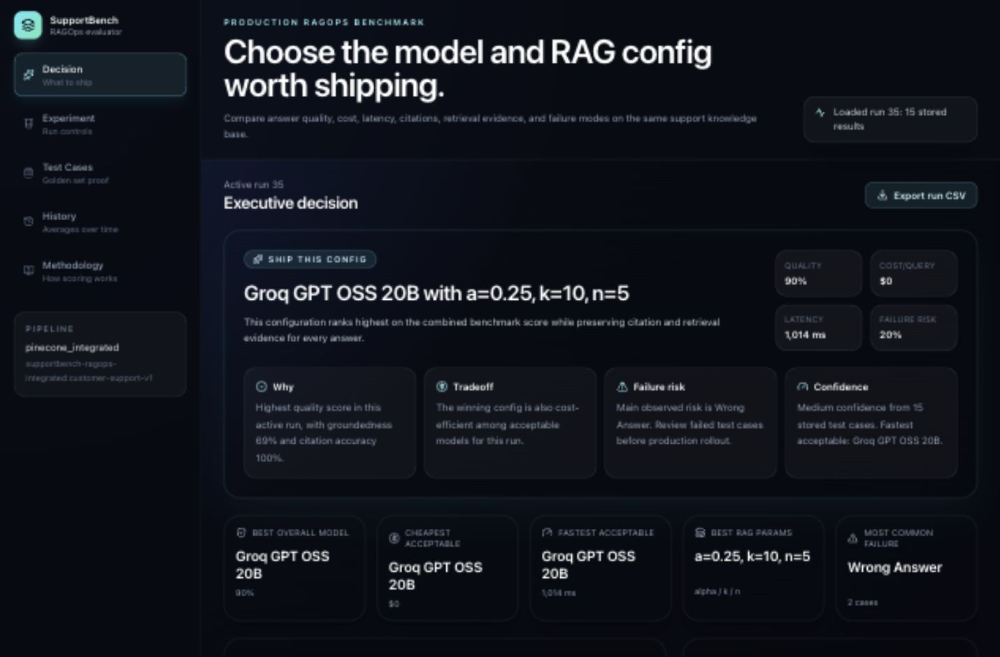
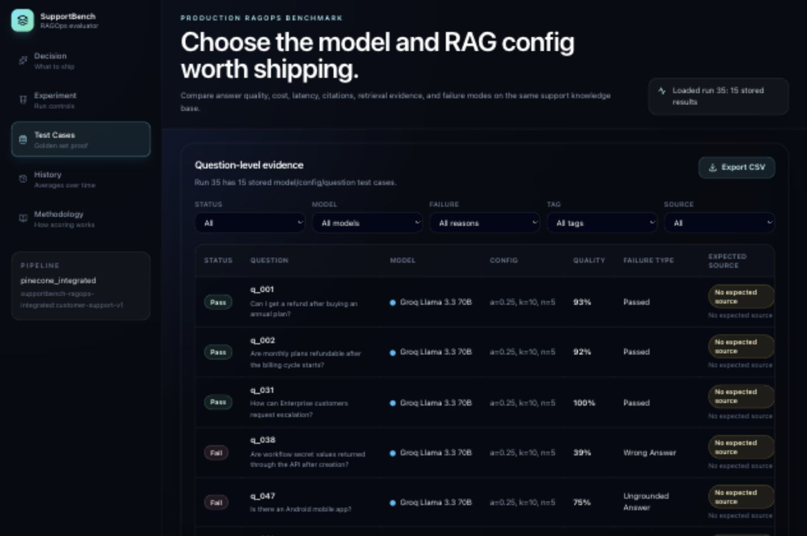
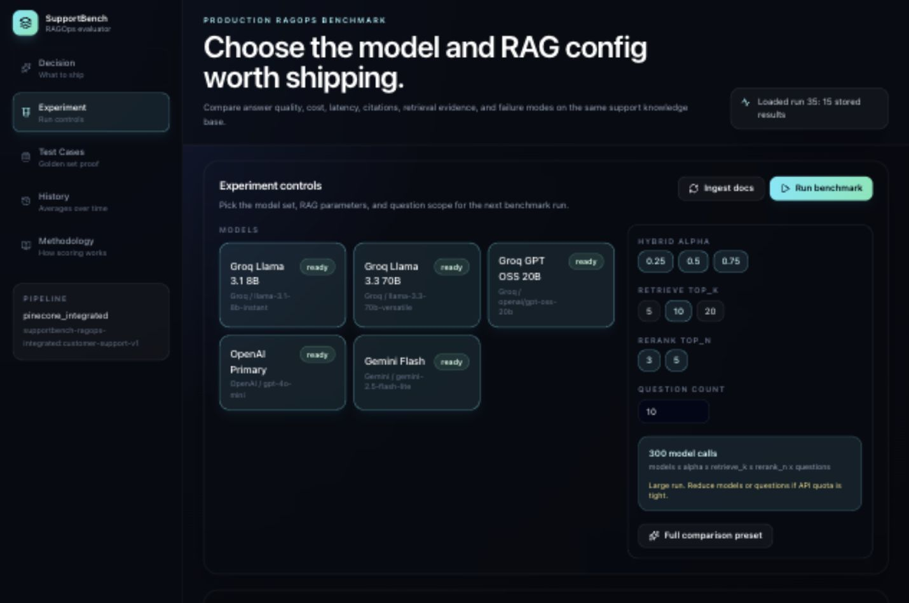
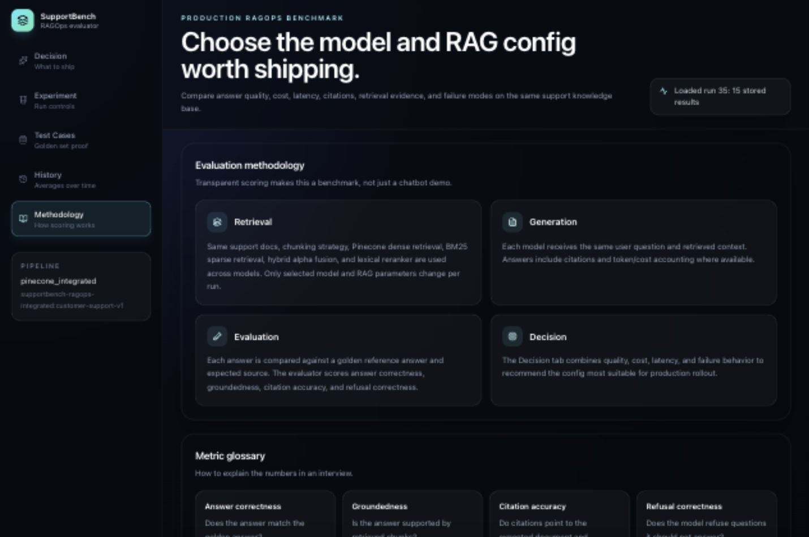
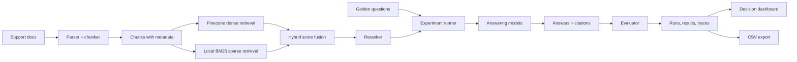

# SupportBench RAGOps

SupportBench RAGOps is a production-style LLMOps dashboard for choosing the best **model + RAG parameter configuration** for a customer-support assistant.

It answers one practical business question:

> Which RAG setup should we ship if we care about answer quality, citations, latency, cost, and failure risk?

This is not another chatbot wrapper. It is an experiment runner, evaluator, trace viewer, and decision dashboard for RAG systems.

## Core Capabilities

- Hybrid retrieval with Pinecone dense search, local BM25, score fusion, reranking, and citations.
- Controlled model comparison across the same documents, retriever, reranker, and evaluation set.
- Run traces with retrieved chunks, prompts, model outputs, cost, latency, and failure categories.
- Decision views that separate the best-quality config from cheaper or faster acceptable configs.
- Test-case evidence with expected answers, generated answers, expected sources, retrieved sources, and answer-quality rationale.

## Screenshots

Current screenshots from the redesigned local UI:

| Decision | Test Evidence |
|---|---|
|  |  |

| Experiment Controls | Methodology |
|---|---|
|  |  |

## Operating Flow

1. Ingest the active support knowledge base into the retrieval pipeline.
2. Pick models, hybrid alpha, retrieve `top_k`, rerank `top_n`, and golden questions.
3. Run the benchmark grid.
4. Open the **Decision** tab to see the recommended config:
   - Ship this config
   - Why
   - Tradeoff
   - Failure risk
   - Confidence
5. Open **Test Cases** to inspect expected answer vs generated answer and expected source vs retrieved source.
6. Export the full run as CSV for review in Excel or Sheets.

## Active Dataset

The app prefers a generated commerce support dataset when this local path exists:

```text
data/generated/souled_store/
```

That dataset is built from:

- `https://www.thesouledstore.com/faqs`
- `https://www.thesouledstore.com/about-us`

The generated dataset currently contains:

| Item | Count |
|---|---:|
| Source pages | 2 |
| FAQ Q/A pairs | 59 |
| Support documents | 6 |
| Golden evaluation questions | 50 |

FAQ entries are used as hidden evaluation ground truth. Retrieval uses passage-style policy documents, so the benchmark is closer to a real support knowledge base than a direct question-answer lookup. The About page is stored separately for brand/company context. The curated `data/generated/souled_store/` dataset is included for deployment; if it is absent, the app falls back to the bundled sample support data.

## Architecture



## What Gets Compared

The retrieval foundation stays controlled:

- same support documentation
- same chunking strategy
- same Pinecone dense index
- same local BM25 index
- same reranker
- same evaluation dataset

The experiment varies:

| Variable | Values |
|---|---|
| Model | Groq-hosted open-source models, OpenAI, Gemini |
| Hybrid alpha | `0.25`, `0.5`, `0.75` |
| Retrieve top_k | `5`, `10`, `20` |
| Rerank top_n | `3`, `5` |
| Questions | User-selected golden support questions |

## Evaluation Methodology

Each model answer is scored against a golden reference answer and expected source. Answer correctness is measured as factual equivalence, not exact wording, so a valid paraphrase can pass if it preserves the same facts.

```text
Quality Score =
40% answer correctness
25% groundedness
20% citation accuracy
15% refusal correctness
```

Cost, latency, and failure rate are tracked separately so a high-quality but expensive model can be compared against a cheaper acceptable model.

Answer correctness uses a mixed evaluator:

- deterministic checks for numbers, dates, prices, email addresses, URLs, retrieval hits, and citation matches
- one fixed low-temperature answer-quality model when configured
- deterministic fallback when the answer-quality model is unavailable

The answer-quality check returns a label, score, rationale, missing facts, and contradictions. Test Cases and CSV exports include these fields.

Failure categories:

| Failure | Meaning |
|---|---|
| Wrong answer | The answer misses or contradicts the reference facts. |
| Ungrounded answer | The answer is not sufficiently supported by retrieved chunks. |
| Missing citation | The answer did not cite the required source. |
| Wrong citation | The citation points to the wrong source. |
| Partial citation | Only some required sources were cited. |
| Bad retrieval | The expected source was not retrieved. |
| Bad refusal | The model refused incorrectly or answered when it should refuse. |

## API Surface

| Endpoint | Purpose |
|---|---|
| `POST /documents/ingest/start` | Async ingestion with progress updates |
| `POST /eval/run/start` | Async benchmark run with progress updates |
| `GET /jobs/{job_id}` | Poll ingestion or benchmark status |
| `GET /eval/questions` | Load golden evaluation questions |
| `GET /eval/runs/{run_id}` | Run details with expected answers and retrieval evidence |
| `GET /eval/runs/{run_id}/export.csv` | Export a full benchmark run |
| `GET /dashboard/summary` | Active run decision dashboard data |
| `GET /dashboard/history` | Historical model/config averages |
| `GET /traces/{trace_id}` | Trace-level retrieved chunks, answer, citations, metrics |

## Model Providers

Default aliases:

| App alias | Provider model |
|---|---|
| `groq_llama_3_1_8b` | `llama-3.1-8b-instant` via Groq |
| `groq_llama_3_3_70b` | `llama-3.3-70b-versatile` via Groq |
| `groq_gpt_oss_20b` | `openai/gpt-oss-20b` via Groq |
| `openai_primary` | `OPENAI_MODEL`, default `gpt-4o-mini` |
| `gemini_flash` | `GEMINI_MODEL`, default `gemini-2.5-flash` |

The app can run in deterministic local mode without real model keys. For live model benchmarks, set `USE_REAL_MODELS=true`.

## Pinecone Setup

Create `.env` in the project root or `backend/.env`:

```env
USE_PINECONE=true
PINECONE_API_KEY=your_pinecone_key
PINECONE_INDEX=supportbench-ragops-integrated
PINECONE_NAMESPACE=customer-support-v1
PINECONE_CLOUD=aws
PINECONE_REGION=us-east-1
PINECONE_EMBEDDING_MODE=integrated
PINECONE_EMBED_MODEL=llama-text-embed-v2
PINECONE_TEXT_FIELD=chunk_text

USE_REAL_MODELS=true
GROQ_API_KEY=your_groq_key
OPENAI_API_KEY=your_openai_key
OPENAI_MODEL=gpt-4o-mini
GEMINI_API_KEY=your_gemini_key
GEMINI_MODEL=gemini-2.5-flash

EVAL_JUDGE_PROVIDER=openai
EVAL_JUDGE_MODEL=gpt-5.4-nano
EVAL_JUDGE_PROMPT_VERSION=answer-judge-v1
```

When `PINECONE_EMBEDDING_MODE=integrated`, Pinecone handles embeddings during upsert/search. This avoids needing OpenAI embedding credits. BM25 remains local because it is the sparse keyword side of the hybrid retrieval experiment.

Set `EVAL_JUDGE_PROVIDER=deterministic` to avoid answer-quality API calls. With `openai`, the evaluator uses the configured GPT answer-quality checker and falls back to deterministic factual scoring when the API is unavailable. Set `EVAL_JUDGE_PROVIDER=auto` only when you want Gemini as a secondary fallback.

## Railway Deployment

This project deploys cleanly on Railway as two services from the same GitHub repository:

| Railway service | Root directory | Dockerfile |
|---|---|---|
| Backend | repository root | `Dockerfile` |
| Frontend | `frontend` | `frontend/Dockerfile` |

Backend environment variables:

```env
APP_ENV=production
DATABASE_URL=sqlite:////app/data_runtime/supportbench.db
SUPPORTBENCH_DATA_DIR=/app/data

USE_REAL_MODELS=true
USE_PINECONE=true
PINECONE_API_KEY=your_pinecone_key
PINECONE_INDEX=supportbench-ragops-integrated
PINECONE_NAMESPACE=customer-support-v1
PINECONE_CLOUD=aws
PINECONE_REGION=us-east-1
PINECONE_EMBEDDING_MODE=integrated
PINECONE_EMBED_MODEL=llama-text-embed-v2
PINECONE_TEXT_FIELD=chunk_text

GROQ_API_KEY=your_groq_key
OPENAI_API_KEY=your_openai_key
OPENAI_MODEL=gpt-4o-mini
GEMINI_API_KEY=your_gemini_key
GEMINI_MODEL=gemini-2.5-flash

EVAL_JUDGE_PROVIDER=openai
EVAL_JUDGE_MODEL=gpt-5.4-nano
EVAL_JUDGE_PROMPT_VERSION=answer-judge-v1
```

Attach a Railway Volume to the backend service at:

```text
/app/data_runtime
```

Frontend environment variable:

```env
NEXT_PUBLIC_API_BASE_URL=https://your-backend-service.up.railway.app
```

After the backend service URL is available, set `NEXT_PUBLIC_API_BASE_URL` on the frontend service and redeploy the frontend. Next.js bakes `NEXT_PUBLIC_*` values into the client bundle at build time.

Railway smoke test:

1. Open `https://your-backend-service.up.railway.app/health`.
2. Open the frontend URL.
3. Run ingestion from the Experiment tab.
4. Confirm Retrieval Status shows The Souled Store dataset.
5. Run a 1-3 question benchmark first.
6. Confirm Decision, Test Cases, Trace, and CSV export work.

## Local Run

Backend:

```bash
cd supportbench-ragops/backend
python -m venv .venv
source .venv/bin/activate
pip install -r requirements.txt
uvicorn app.main:app --host 127.0.0.1 --port 8000
```

Frontend:

```bash
cd supportbench-ragops/frontend
npm install
npm run dev
```

Open `http://localhost:3000`.

## Tests

Backend:

```bash
cd supportbench-ragops/backend
python3 -m unittest discover -s tests -p 'test_*.py'
```

Frontend:

```bash
cd supportbench-ragops/frontend
npm run build
```

## Known Limits

- The LLM answer-quality checker improves paraphrase handling, but the same fixed checker model should be used across a benchmark for fair comparisons.
- BM25 is local in v1; dense retrieval uses Pinecone when enabled.
- No auth, tenancy, billing, or production deployment pipeline is included in this version.
- API free tiers can rate-limit larger benchmark grids; run small smoke tests when quota is tight.

## Project Summary

**SupportBench RAGOps** benchmarks model/provider choices and retrieval parameters across correctness, groundedness, citation accuracy, refusal behavior, latency, cost, and failure categories, then recommends the configuration to ship.
